# Bevan Health and Fitness

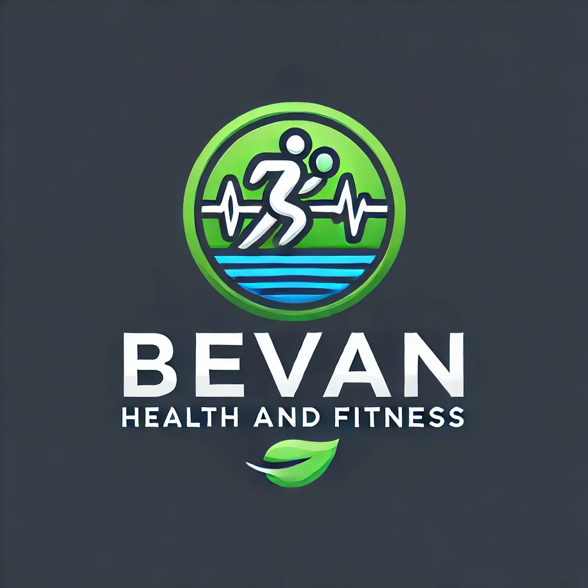

Welcome to **Bevan Health and Fitness**, an intuitive platform designed to help users manage their fitness goals, track progress, and achieve a healthier lifestyle. Whether you're just starting your fitness journey or are a seasoned athlete, our app provides the tools and insights to keep you on track.

[Live Project: Bevan Health and Fitness](https://bevanhealthandfitness-6624380c9483.herokuapp.com/)

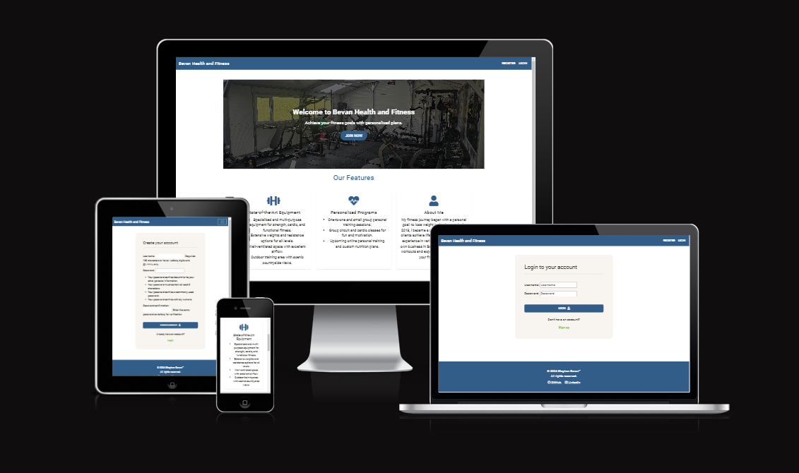

---

## Table of Contents

1. [User Experience (UX)](#user-experience-ux)
2. [Agile Development](#agile-development)
3. [Features](#features)
4. [Design](#design)
5. [Technologies Used](#technologies-used)
6. [Testing](#testing)
7. [Known Bugs](#known-bugs)
8. [Deployment](#deployment)
9. [Future Features](#future-features)
10. [Credits and Acknowledgements](#credits-and-acknowledgements)

---

## User Experience (UX)

### **Goals**
- Ensure accessibility for all fitness levels.
- Streamline the user journey, from sign-up to tracking workouts.
- Motivate users through engaging design and personalized content.

### **Target Audience**
- Fitness enthusiasts of all levels.
- Users looking for an intuitive way to track and manage workouts.
- Individuals seeking motivation and insights into their fitness progress.

### **Wireframes**
- Developed using **Balsamiq** for layout planning.

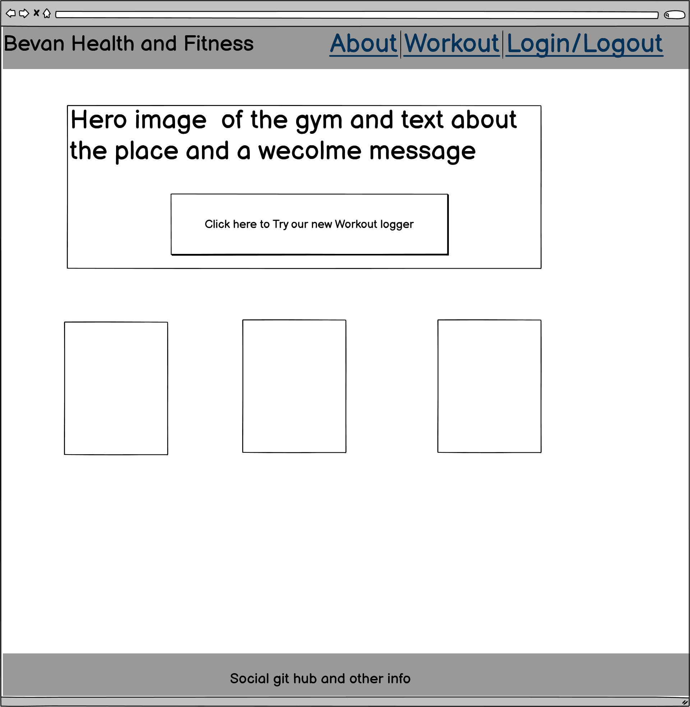
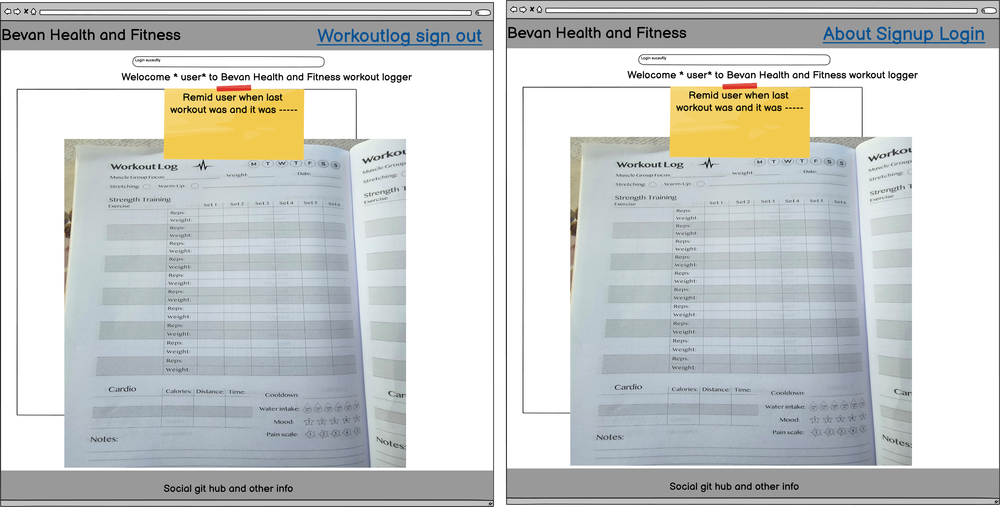
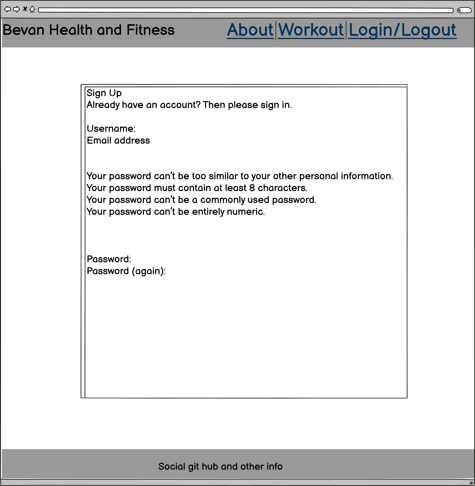

### **Database Planning**
- Designed using an **Entity Relationship Diagram (ERD)**.

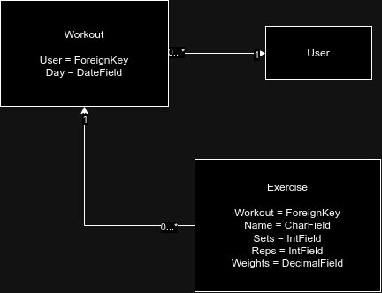

---

## Agile Development

This project follows an **Agile Development** methodology with regular iterations and continuous feedback loops.

### **User Stories Overview**
1. As a user, I can create an account so that I can save my workouts.
2. As a user, I can log my workouts to track my fitness progress.
3. As a user, I can update or delete my workouts to keep my log accurate.

### **Kanban Board**
Project management was conducted using GitHub Projects. [View the Project Board](https://github.com/users/Stephen-Bevan/projects/7).

---

## Features

### **Hero Section**
- Engaging hero banner with a welcoming message and a clear call-to-action for registration.
- Overlay effect with prominent text and buttons.

### **Navigation Bar**
- Fully responsive navbar with dynamic features:
  - Links to Home, Login, and Register for unauthenticated users.
  - Links to Dashboard and Logout for authenticated users.
  - Dynamic display of the logged-in user’s username.

### **Dashboard**
- A personalized space with:
  - User-specific greetings.
  - Quick links for managing workouts:
    - "My Workouts Log."
    - Create a new workout.
    - Placeholder links for future features like class booking and nutrition plans.

### **Workout Management**
- **Create/Update Workout Form**:
  - Fields for workout name, day, sets, reps, and weights.
  - Real-time validation with clear error messages.
  - Dynamically enabled/disabled "Save Workout" button.
- **Workout List**:
  - Displays all logged workouts with edit and delete options.
  - Notifications for successful operations.

### **404 Page**
- Custom 404 page with friendly messaging and a redirect button to the homepage.

---

## Design

### **Fonts**
- **Roboto (Google Font)**: Modern and highly readable.

### **Color Scheme**
- **Blue and White**: Evokes trust and clarity.
- **Green Accents**: Represents health and progress.

### **Responsive Design**
- Compatibility across devices ensured with **Bootstrap** and **CSS media queries**.

---

## Technologies Used

### **Languages**
- HTML5
- CSS3
- Python/Django
- JavaScript

### **Database**
- ElephantSQL PostgreSQL

### **Libraries & Tools**
- **Bootstrap**: For responsive design.
- **FontAwesome**: Icons for enhanced visuals.
- **GitHub**: Repository management.
- **Visual Studio Code**: Code editor.
- **Balsamiq**: Wireframe creation.
- **Cloudinary**: Image storage.

---

## Testing

### **Manual Testing**

| Feature                 | Action                          | Expected Outcome              | Result             |
|-------------------------|---------------------------------|-------------------------------|--------------------|
| Hero Section CTA Button | Click "Join Now"               | Redirects to Register page    | Worked as expected |
| Navigation Links        | Click navbar links             | Redirects to correct pages    | Worked as expected |
| User Registration       | Submit valid/invalid inputs    | Account created or error shown | Worked as expected |
| Log In                  | Enter valid/invalid credentials | Logs in or shows error        | Worked as expected |
| Dashboard Links         | Click quick links              | Navigates to target pages     | Worked as expected |
| Create Workout Form     | Fill out and submit            | Saves workout to database     | Worked as expected |
| Edit/Delete Workout     | Use respective buttons         | Updates or removes workout    | Worked as expected |
| 404 Page                | Access invalid URL             | Displays custom 404 page      | Worked as expected |

### **Compliance Testing**

- **PEP8 Compliance**: Python code adheres to PEP8 standards.
  
  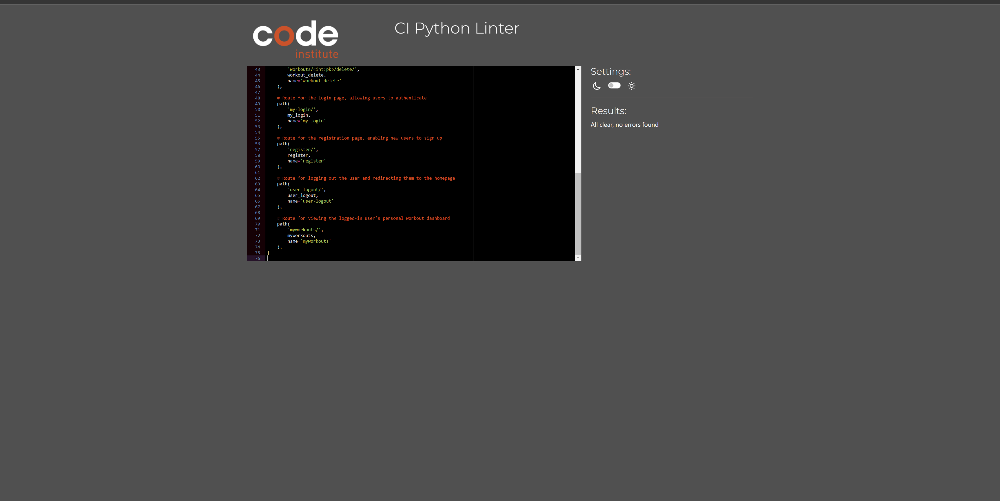

- **HTML Validation**: Templates validated for errors.
  
  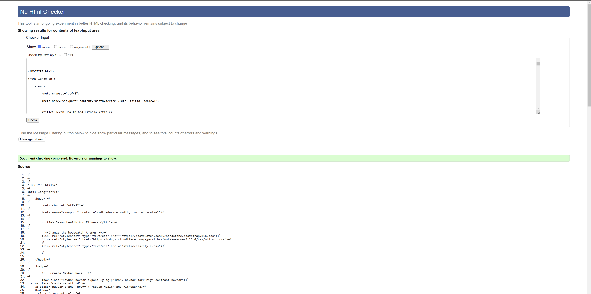

- **CSS Validation**: All stylesheets validated error-free.
  
  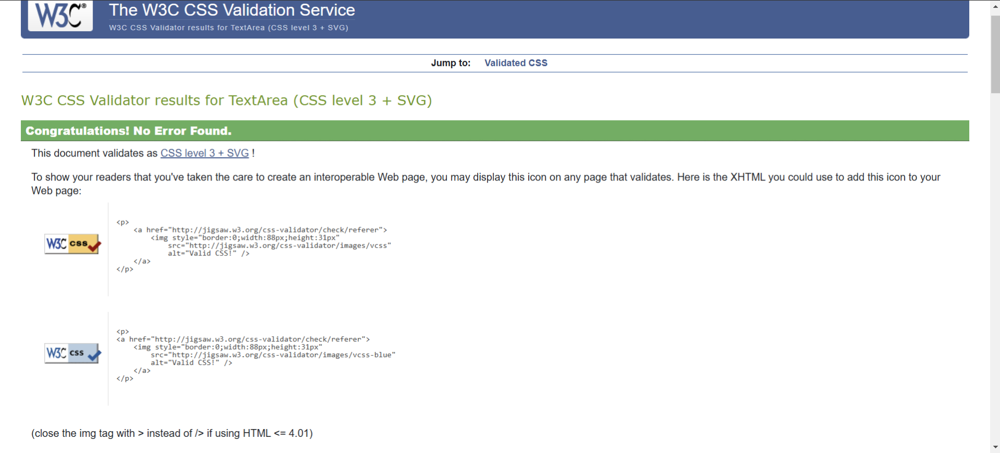

- **JS Validation**: Templates validated for errors.
  
  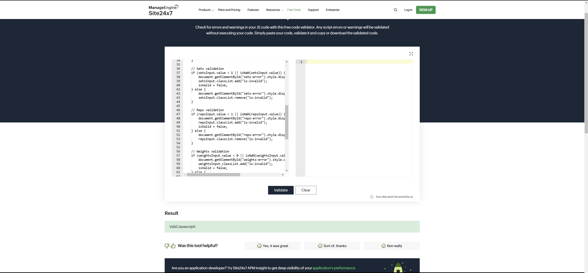

### **Testing Screenshots**

- Hero Section Testing:
  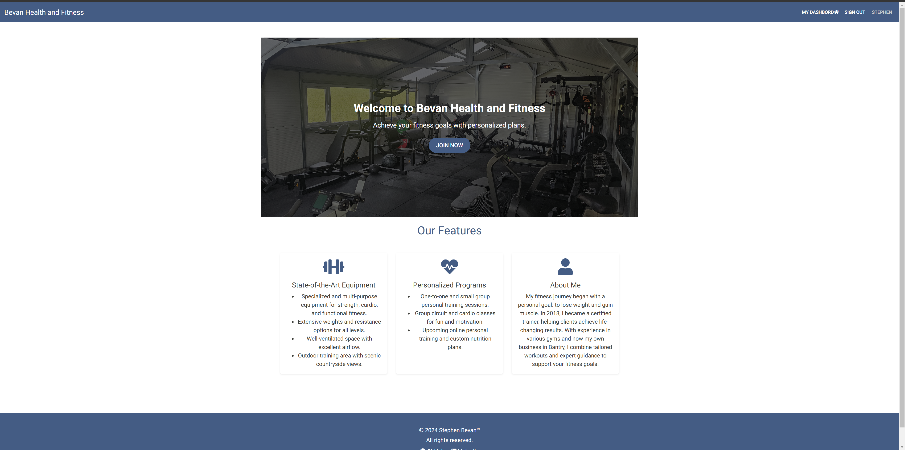

- Navigation Links Testing:
  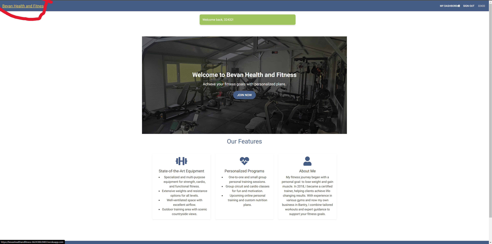

- User Registration Testing:
  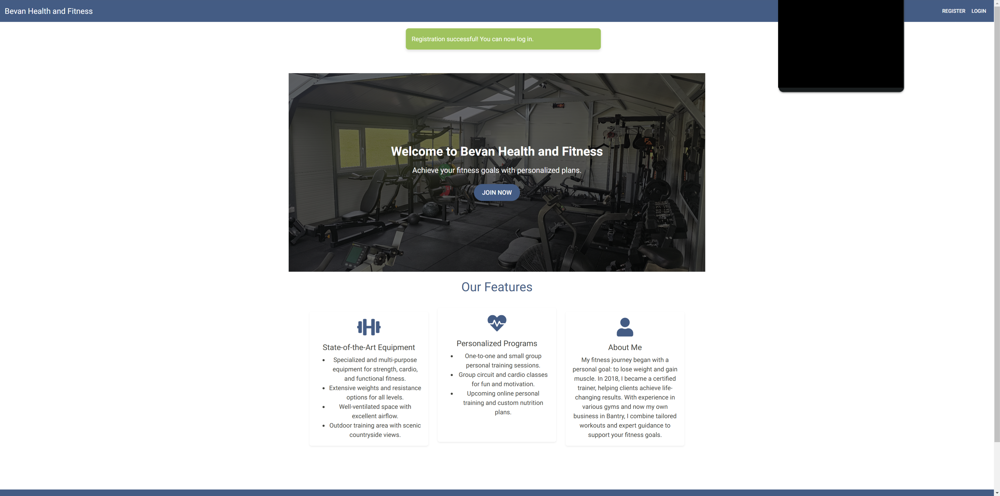

- Log In Testing:
  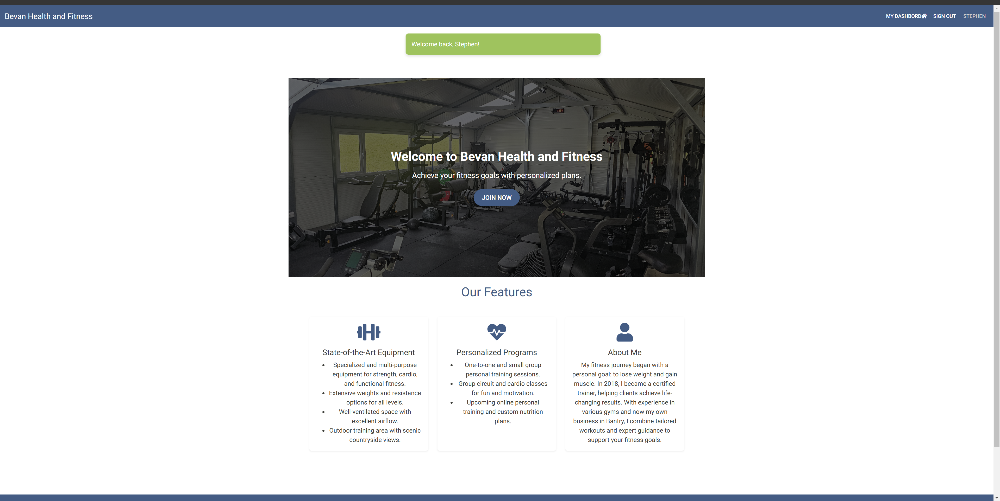

- Dashboard Links Testing:
  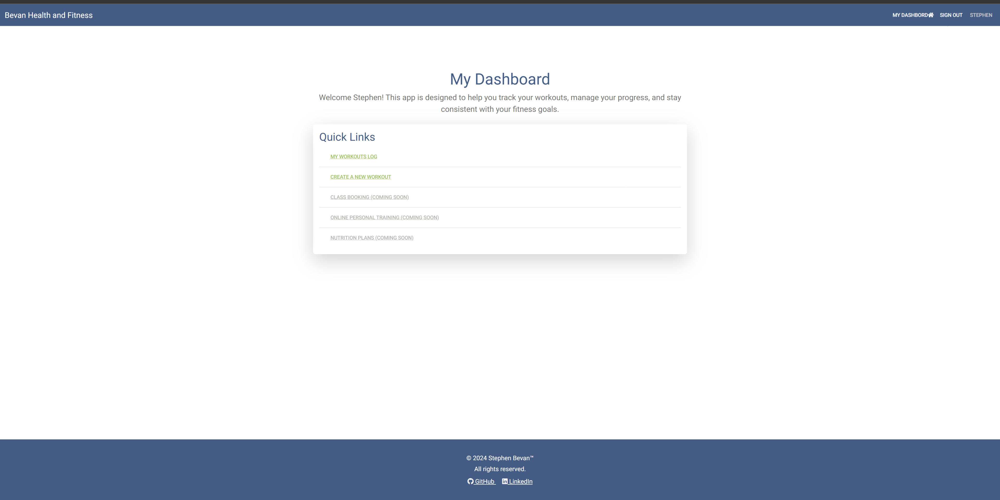

- Create Workout Form Testing:
  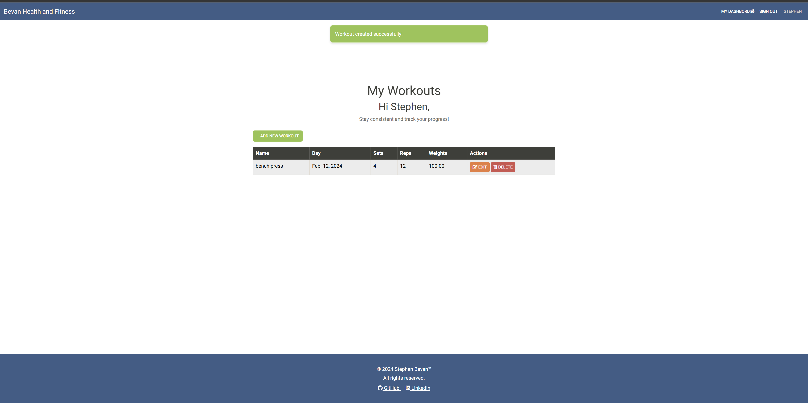

- Edit/Delete Workout Testing:
  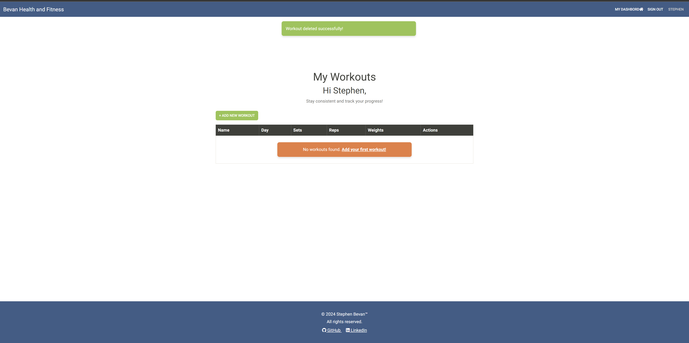

- 404 Page Testing:
  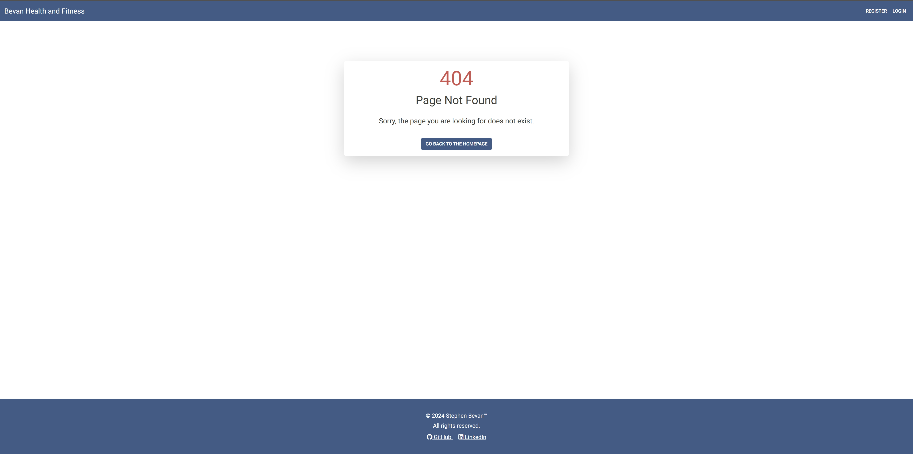

---

## Known Bugs

- **Django Alert Message**: Alert messages are white and unreadable when a user attempts to register with a username already taken. This issue remains unresolved but is marked for future updates.

  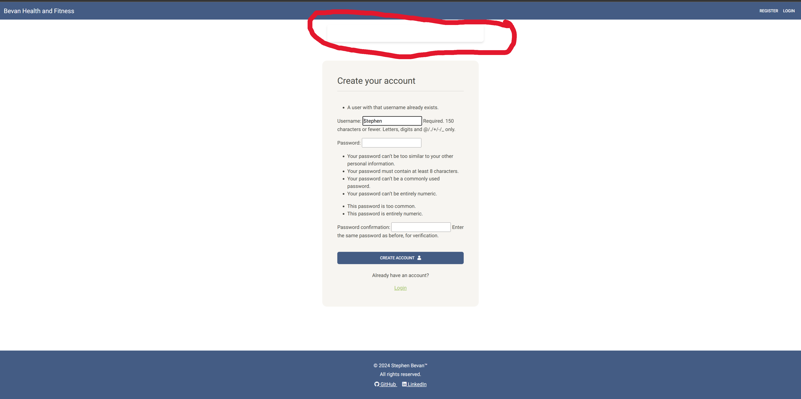

- **Date Resets Issue**: When editing a record, the date resets. Additionally, the weight field does not display "kg" as intended. 

  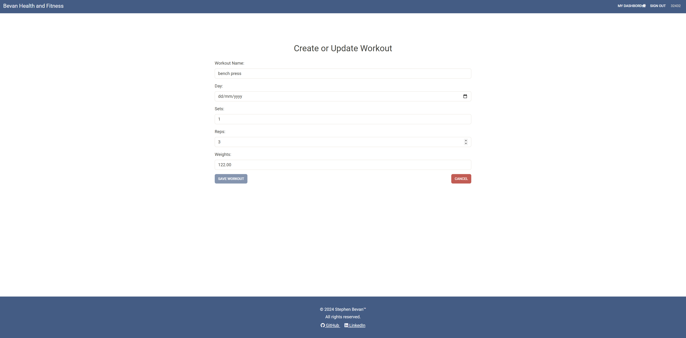

---

### **Lighthouse testing **

main page 

other pages 

### **WCAG Color contrast testing **

## Deployment

### **Steps**

1. Created the Heroku app.
2. Set up environment variables for secure data handling.
3. Configured Procfile for deployment.
4. Pushed the project to Heroku via Git.

### **Forking the Repository**

1. Navigate to the [GitHub Repository](https://github.com/Stephen-Bevan/bevanhealthandfitness).
2. Click "Fork" at the top right of the page.

### **Cloning the Repository**

1. Navigate to the [GitHub Repository](https://github.com/Stephen-Bevan/bevanhealthandfitness).
2. Click the "Code" button.
3. Copy the HTTPS link and run `git clone [link]` in your terminal.

---

## Future Features

1. **Class Booking**
   - Allow users to schedule group classes directly on the platform.
2. **Online Personal Training**
   - Provide virtual training sessions and personalized workout plans.
3. **Nutrition Plans**
   - Introduce tailored nutrition plans to complement users’ fitness goals.

---

## Credits and Acknowledgements

### **Resources**
- [CRUD Mastery with Django](https://www.youtube.com/watch?v=pqWyUAT38e0&t=2806s)
- [Davidcalikes: Mypse Project](https://github.com/davidcalikes/mypse.ie/blob/main/passport/views.py)

### **Guidance and Inspiration**
- **Code Institute LMS**: Guidance and templates.
- **Coding Coaches and Staff at Code Institute**: David, John, and Kevin.
- **ChatGPT and Stack Overflow**: Bug fixes and optimization.

### **Tools and Assets**
- **Balsamiq**: Wireframe creation.
- **FontAwesome**: Visual enhancements.
- **Google**: Resources for troubleshooting and inspiration.

