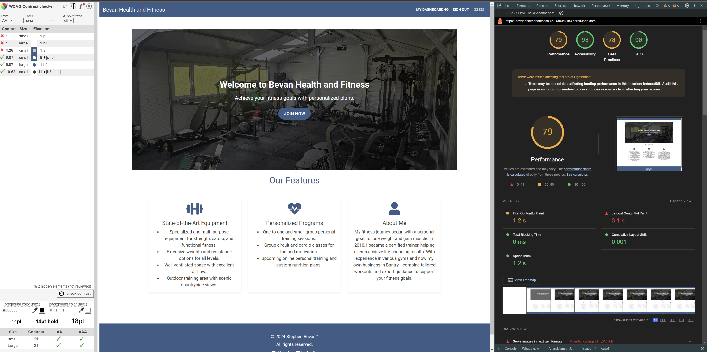
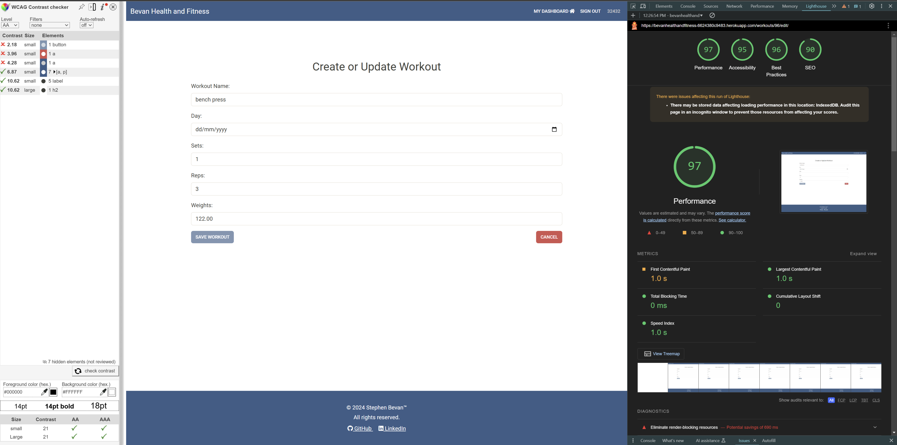
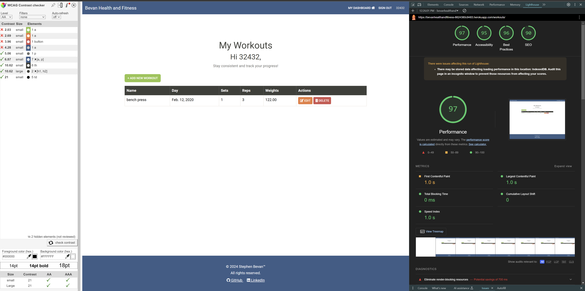
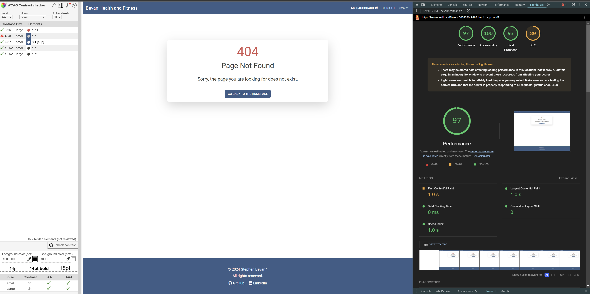

# Bevan Health and Fitness


Welcome to **Bevan Health and Fitness**, an intuitive platform designed to help users manage their fitness goals, track progress, and achieve a healthier lifestyle. Whether you're just starting your fitness journey or are a seasoned athlete, our app provides the tools and insights to keep you on track.

[Live Project: Bevan Health and Fitness](https://bevanhealthandfitness-6624380c9483.herokuapp.com/)


---

## Table of Contents

1. [User Experience (UX)](#user-experience-ux)
2. [Agile Development](#agile-development)
3. [Features](#features)
4. [Design](#design)
5. [Technologies Used](#technologies-used)
6. [Testing](#testing)
7. [Known Bugs](#known-bugs)
8. [Deployment](#deployment)
9. [Future Features](#future-features)
10. [Credits and Acknowledgements](#credits-and-acknowledgements)

---

## User Experience (UX)

### **Goals**
- Ensure accessibility for all fitness levels.
- Streamline the user journey, from sign-up to tracking workouts.
- Motivate users through engaging design and personalized content.

### **Target Audience**
- Fitness enthusiasts of all levels.
- Users looking for an intuitive way to track and manage workouts.
- Individuals seeking motivation and insights into their fitness progress.

### **Wireframes**
- Developed using **Balsamiq** for layout planning.


### **Database Planning**
- Designed using an **Entity Relationship Diagram (ERD)**.


---

## Agile Development

This project follows an **Agile Development** methodology with regular iterations and continuous feedback loops.

### **User Stories Overview**
1. As a user, I can create an account so that I can save my workouts.
2. As a user, I can log my workouts to track my fitness progress.
3. As a user, I can update or delete my workouts to keep my log accurate.

### **Kanban Board**
Project management was conducted using GitHub Projects. [View the Project Board](https://github.com/users/Stephen-Bevan/projects/7).

---

## Features

### **Hero Section**
- Engaging hero banner with a welcoming message and a clear call-to-action for registration.
- Overlay effect with prominent text and buttons.

### **Navigation Bar**
- Fully responsive navbar with dynamic features:
  - Links to Home, Login, and Register for unauthenticated users.
  - Links to Dashboard and Logout for authenticated users.
  - Dynamic display of the logged-in user’s username.

### **Dashboard**
- A personalized space with:
  - User-specific greetings.
  - Quick links for managing workouts:
    - "My Workouts Log."
    - Create a new workout.
    - Placeholder links for future features like class booking and nutrition plans.

### **Workout Management**
- **Create/Update Workout Form**:
  - Fields for workout name, day, sets, reps, and weights.
  - Real-time validation with clear error messages.
  - Dynamically enabled/disabled "Save Workout" button.
- **Workout List**:
  - Displays all logged workouts with edit and delete options.
  - Notifications for successful operations.

### **404 Page**
- Custom 404 page with friendly messaging and a redirect button to the homepage.

---

## Design

### **Fonts**
- **Roboto (Google Font)**: Modern and highly readable.

### **Color Scheme**
- **Blue and White**: Evokes trust and clarity.
- **Green Accents**: Represents health and progress.

### **Responsive Design**
- Compatibility across devices ensured with **Bootstrap** and **CSS media queries**.

---

## Technologies Used

### **Languages**
- HTML5
- CSS3
- Python/Django
- JavaScript

### **Database**
- ElephantSQL PostgreSQL

### **Libraries & Tools**
- **Bootstrap**: For responsive design.
- **FontAwesome**: Icons for enhanced visuals.
- **GitHub**: Repository management.
- **Visual Studio Code**: Code editor.
- **Balsamiq**: Wireframe creation.
- **Cloudinary**: Image storage.

---

## Testing

### **Manual Testing**

| Feature                 | Action                          | Expected Outcome              | Result             |
|-------------------------|---------------------------------|-------------------------------|--------------------|
| Hero Section CTA Button | Click "Join Now"               | Redirects to Register page    | Worked as expected |
| Navigation Links        | Click navbar links             | Redirects to correct pages    | Worked as expected |
| User Registration       | Submit valid/invalid inputs    | Account created or error shown | Worked as expected |
| Log In                  | Enter valid/invalid credentials | Logs in or shows error        | Worked as expected |
| Dashboard Links         | Click quick links              | Navigates to target pages     | Worked as expected |
| Create Workout Form     | Fill out and submit            | Saves workout to database     | Worked as expected |
| Edit/Delete Workout     | Use respective buttons         | Updates or removes workout    | Worked as expected |
| 404 Page                | Access invalid URL             | Displays custom 404 page      | Worked as expected |

### **Compliance Testing**

- **PEP8 Compliance**: Python code adheres to PEP8 standards.
  
  

- **HTML Validation**: Templates validated for errors.
  
  

- **CSS Validation**: All stylesheets validated error-free.
  
  

- **JS Validation**: Templates validated for errors.
  
  

### **Testing Screenshots**

- Hero Section Testing:  
  

- Navigation Links Testing:  
  

- User Registration Testing:  
  

- Log In Testing:  
  

- Dashboard Links Testing:  
  

- Create Workout Form Testing:  
  

- Edit/Delete Workout Testing:  
  

- 404 Page Testing:  
  

---

## Known Bugs

- **Django Alert Message**: Alert messages are white and unreadable when a user attempts to register with a username already taken. This issue remains unresolved but is marked for future updates.
  
  

- **Date Resets Issue**: When editing a record, the date resets. Additionally, the weight field does not display "kg" as intended.
  
  

---
### **Lighthouse Testing and WCAG Contrast Testing**

#### **Main Page**  


#### **Create Workout**  


#### **Workout List**  


#### **404 Page Testing**  


### **Notes**  
The Lighthouse score for the home page and WCAG contrast for all pages will be improved in future versions.


## Deployment Guide

### 1. Creating the Heroku App

#### Step-by-Step Instructions:
1. **Sign Up or Log In to Heroku:**
   - Navigate to [Heroku's website](https://heroku.com) and either create an account or log in.

2. **Create a New App:**
   - In your Heroku Dashboard, click on **"New"**, then select **"Create New App"**.
   - Enter a unique name for your project, such as "SplitBuddy".
   - Select **EU** as the region.
   - Click **"Create App"**.

3. **Configure Deployment Method:**
   - Go to the **"Deploy"** tab and choose **GitHub** as your deployment method.
   - Connect your GitHub account and locate the repository for your project.
   - Link the repository to your Heroku app.

---

### 2. Setting Up Environment Variables

#### Steps:
1. **Create an `env.py` File:**
   - In the top-level directory of your Django project, create a file named `env.py`.
   - Import the `os` module in this file.

2. **Define Environment Variables:**
   - Set up the necessary variables, such as the secret key and database URL, in `env.py`.

3. **Update `settings.py`:**
   - Modify `settings.py` to retrieve these variables using `os.getenv()`.

4. **Configure Variables on Heroku:**
   - Navigate to the **"Settings"** tab of your Heroku app.
   - Under **"Config Vars"**, add the same variables from your `env.py` file.

5. **Database Migration:**
   - Update your terminal with the new database connection and run migrations to sync your models.

6. **Static Files and Templates:**
   - Ensure your `settings.py` file is configured correctly for static files and templates.

7. **Allowed Hosts:**
   - Add your Heroku app's URL to the `ALLOWED_HOSTS` list in `settings.py`.

---

### 3. Creating the Procfile and Pushing Changes

#### Steps:
1. **Create a Procfile:**
   - In the root directory of your project, create a file named `Procfile`.
   - Add the command to run the project, e.g., `web: gunicorn <your_project_name>.wsgi`.

2. **Commit and Push:**
   - Use Git to stage, commit, and push your changes to the GitHub repository:
     ```bash
     git add .
     git commit -m "Prepare for Heroku deployment"
     git push origin main
     ```

---

### 4. Deploying to Heroku

#### Steps:
1. **Manual Deployment:**
   - In Heroku, go to the **"Deploy"** tab and manually deploy the desired branch.

2. **Monitor Logs:**
   - Check the build logs for any issues during deployment.

3. **Live Site:**
   - Upon a successful deployment, Heroku will display a link to your live site.

4. **Troubleshooting:**
   - If errors arise, debug by checking logs and adjusting your code or configuration as needed.

---

### 5. Forking the Repository

#### Steps:
1. **Log In to GitHub:**
   - Access your GitHub account or create one if you don’t already have an account.

2. **Fork the Repository:**
   - Visit the repository’s page on GitHub.
   - Click on the **"Fork"** button at the top of the page to create your own copy.

---

### 6. Cloning the Repository

#### Steps:
1. **Copy Repository URL:**
   - On the repository’s GitHub page, click the **"<> Code"** button.
   - Under the **"Local"** tab, select **HTTPS** and copy the provided URL.

2. **Clone the Repository Locally:**
   - Open your terminal and navigate to your desired folder.
   - Run the following command, replacing `<repository-url>` with the copied URL:
     ```bash
     git clone <repository-url>
     ```

---

## Future Features

1. **Class Booking**
   - Allow users to schedule group classes directly on the platform.
2. **Online Personal Training**
   - Provide virtual training sessions and personalized workout plans.
3. **Nutrition Plans**
   - Introduce tailored nutrition plans to complement users’ fitness goals.

---

## Credits and Acknowledgements

### **Resources**
- [CRUD Mastery with Django](https://www.youtube.com/watch?v=pqWyUAT38e0&t=2806s)
- [Davidcalikes: Mypse Project](https://github.com/davidcalikes/mypse.ie/blob/main/passport/views.py)

### **Guidance and Inspiration**
- **Code Institute LMS**: Guidance and templates.
- **Coding Coaches and Staff at Code Institute**: David, John, and Kevin.
- **ChatGPT and Stack Overflow**: Bug fixes and optimization.

### **Tools and Assets**
- **Balsamiq**: Wireframe creation.
- **FontAwesome**: Visual enhancements.
- **Google**: Resources for troubleshooting and inspiration.

